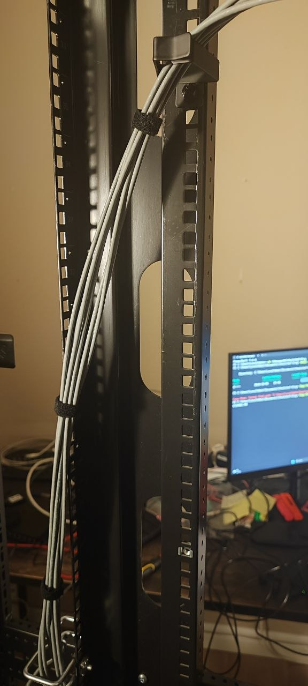
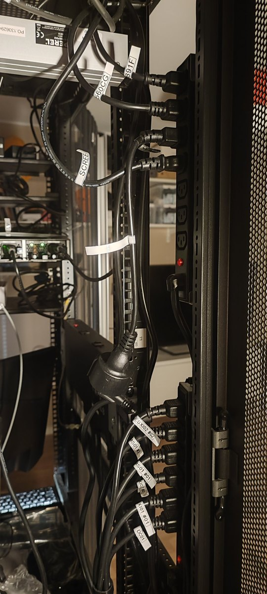
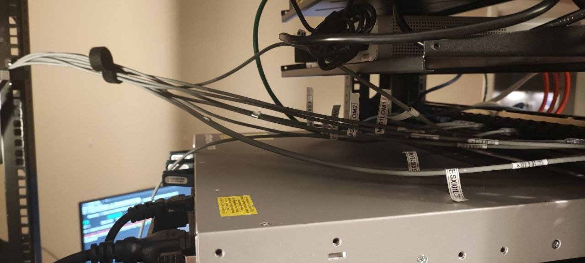

Two things happened this week. One of them was tidy.

## The tidy one

The cable separation is finished. Power runs down the left side of the rack where the strips are. Network and the other low-voltage cables now run down the right side. Every power tail is labelled — which device, which supply — so the two feeds into each server can be told apart without counting.

Last week I wrote that a rack where you cannot follow a cable is a rack that will lie to you at midnight. That part is now fixed.

Then I went looking at the documents, where the lying had moved.

## The other one

I set aside an evening for housekeeping. Tidy up a few loose ends in the project files, close some gaps, feel productive.

Four hours later I had reopened an entire phase.

Phase 0 is the governance phase. The rulebook. The project charter, the documentation standard, the change procedure, the master document — all the boring paperwork written before any equipment was touched, which is the whole premise this project is built on.

I closed Phase 0 back in July. I was quite pleased about it.

This week I checked it properly, against its own acceptance criteria, which is apparently a thing I had not actually done.

The documentation standard was approved while still marked **Draft**. The master document does not follow the eight-part format that the standard requires — the format it exists to enforce. And the change-management procedure, which governs how changes are made, turns out not to cover changes to infrastructure. Which is the only kind of change this project makes.

So the gate that let Phase 0 through was not a gate. It was me, reading my own work, and agreeing with it.

## Thirteen cards later

The correction plan runs to thirteen cards across four stages, plus a backlog. Rewrite the standard. Write an operational change procedure that actually covers device changes, and retro-record the two changes already made without one. Rebuild the master document so every pointer in it resolves. Remove claims about folders that do not exist. Create the ADR folder that several documents already reference.

Phase 1 stays open. Its documents contradict each other in a dozen small ways — a port count, a naming convention, a stale reference, an assumption about an address — none fatal, all of them the kind of thing that turns into a wasted hour at the wrong moment.

Two cards are done already. Rack inventory verification is merged, and the admin workstation hardening is finished — which also meant checking a validation document that had been claiming the hardened end state for about three weeks before it was true.

## The rule I wrote down afterwards

At the top of the plan there are five rules. The first one is the one that cost me the evening:

**Approve only against acceptance criteria — checked, not assumed.**

Every document in this project has a list of things that must be true before it can be approved. I wrote those lists myself. I just wasn't reading them at approval time — I was reading the document, thinking *yes, that looks right*, and ticking it off.

A review you conduct on your own work, without the checklist in front of you, is not a review. It is agreement with extra steps.

This is now the second time one of my own quality gates has caught me. In July the change-management procedure failed its own first review. This week the entire phase did.

I would be more annoyed if the alternative weren't obvious: finding out in Phase 3, with servers running on top of it.

## Early is cheap

This is the argument for a living project rather than a finished one.

Right now there are three network devices, no servers, and nothing depending on any of it. Reopening the governance phase costs me some evenings and a long list of cards. Nothing is down. Nobody is waiting.

The same discovery in six months — with hosts running, services on top, and documents that have been wrong for long enough that other documents now quote them — costs something entirely different. Corrections compound. So does the mess if you leave it.

Fixing things here and there, now, while the whole thing is still small enough to hold in your head, is the cheapest it will ever be. That is not a consolation. It is the actual plan.

## Next on the rack

A second patch panel goes in under the core switch, with 0.15 m patch cables — short enough that a cable goes straight across rather than looping down and back.

The point is to split the network layer and the server layer onto their own panels, so the front of the rack shows you what it is doing. Right now the front is correct and unreadable. Those are not the same thing.

Credit where it is due: most of what I have been applying here comes from TCI Productions' [Home Network Cable Management How-To](https://youtube.com/playlist?list=PLrnGjyjSWyBJNA4ex7lr_VqofUOpdNvWi) — fourteen videos. It is the clearest material I have found on doing this properly rather than just neatly, and it is free. If you are about to tidy a rack, watch it first and save yourself doing the job twice.

The cables are sorted. The paperwork is being sorted. The rack, for once, is the honest part.

---

*I'm Ioannis — an IT operations, systems, and networking engineer based near Stockholm. The Itchef Hybrid Project (IHPC) is a real hybrid infrastructure lab, built and documented in public. Repo: [github.com/TheITchef/IHPC](https://github.com/TheITchef/IHPC) · [LinkedIn](https://www.linkedin.com/in/ioannis-mintzivyris-a1b77873/)*
