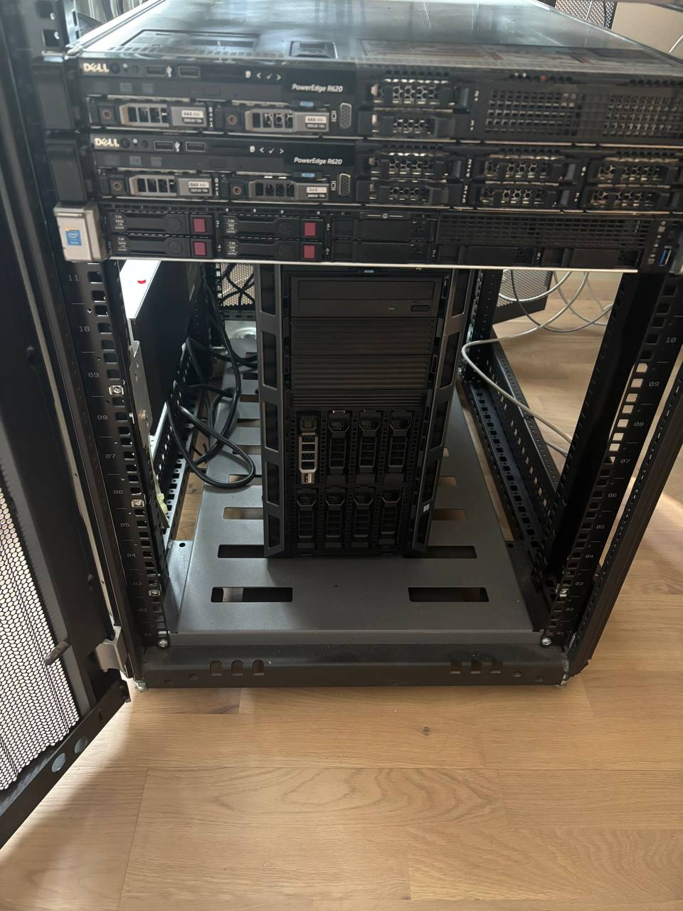
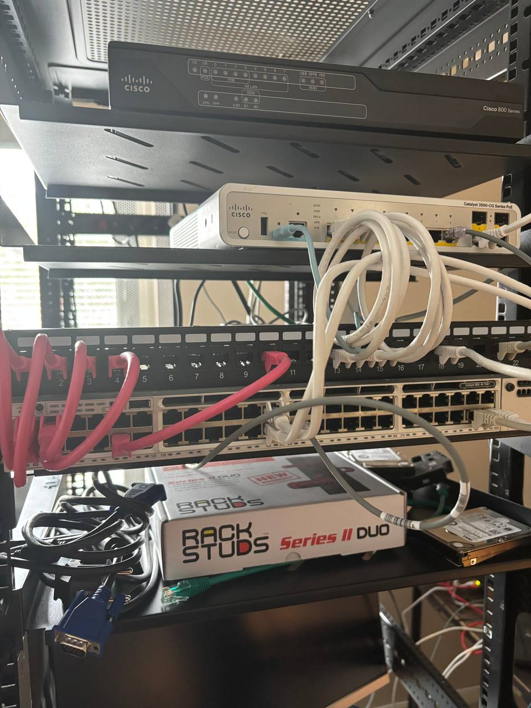

Some people put a nice plant in the corner of the living room. I put a 42U server rack there. My interior design philosophy is best described as "enterprise data centre, but cosy."

I've spent 10+ years doing hands-on IT — L2/L3 support, sysadmin work, Windows Server and Active Directory, Cisco networking, keeping real environments running for real users who very much notice when things stop working. The lab is where I keep those instincts sharp and break things on purpose so I'm faster when they break by accident. Also, admittedly, because the sound of servers spinning up is oddly comforting to a certain kind of person. You know if you're that kind of person.And most probably,you also own a good pair of headphones (yes Senheiser,I men you) along with Spotify.

This isn't a spec sheet. It's a tour of what I run, how I keep it alive, and the operational habits behind it.

## The compute layer: four servers, four jobs

**itc-uvy-dc01 — Dell PowerEdge T330.** The domain controller, and the most disciplined box in the rack. Windows Server 2025 on bare metal — AD DS, DNS, DHCP — and exactly one job. This is the machine I treat like production, because in every environment I've supported, when identity or DNS goes sideways, the ticket queue lights up like a Christmas tree. So the DC runs on its own hardware,boring, and reliable. Boring is a compliment here.

**itc-uvy-esxi01 — Dell PowerEdge R620.** The VMware host: dual Xeon, 192GB RAM, ESXi 8.0. This is where most of the VM estate lives — the Windows and Linux servers I use to practise the actual day job: user and group management, GPO troubleshooting, patching, breaking DNS and fixing it again. R620s are the second-hand workhorse of home labs everywhere, and for good reason.

**itc-uvy-esxi02 — an identical R620,** currently kept as a spare / staging host. Having a second identical box is a luxury I lean on constantly: I can stand up a test scenario, wreck it, and rebuild without touching the environment I actually rely on. Anyone who has done change work knows the value of a place to fail safely.

**itc-uvy-ms01 — HPE ProLiant DL360 Gen9.** The Microsoft services host: Hyper-V on Windows Server 2025 Datacenter, 256GB of RAM. This is where the corporate-feeling estate lives — SCCM, WSUS, certificate services. 256GB because SCCM never travels alone; it brings a SQL Server and a large appetite. This box is my sandbox for the endpoint-management and patching work that made up a big chunk of my support career.

## Keeping it running: the boring habits that matter

The hardware is the easy part. The reason the lab is useful is the operational discipline around it, which is exactly what L2/L3 and sysadmin work rewards:

**Out-of-band management, taken seriously.** Every iDRAC and iLO lives on a dedicated Cisco Catalyst 3560CG, physically separate from the data network. Why a whole switch just for management? Because one day I *will* fat-finger a trunk on the core switch — and when I do, I need to reach the servers' lights-out management without a crash cart and a walk of shame. Anyone who has ever locked themselves out of a remote host mid-change felt that sentence in their soul. There's a reason "console access" is the first thing you check when a change goes wrong.

**Separate admin workstations.** Administration happens only from dedicated privileged access workstations. The machine that touches server management interfaces is not the same machine that browses the internet. It's a habit worth having whether you're supporting 10 servers or 10,000 endpoints.

**Documentation before you need it.** Every device is inventoried before it goes in the rack — model, controller, iLO/iDRAC details, rack position. Because troubleshooting at 2 a.m. is not the moment to be guessing which box has which RAID controller. If you've ever inherited an undocumented environment, you already know why I'm strict about this one.

## The network: the part I enjoy most

The switching layer is the closest thing to production in the whole lab, and honestly my favourite part to work on. A Cisco Catalyst 3850-48 as the L3 core, a Cisco 891F at the edge, and the 3560CG handling out-of-band. This is where I practise VLANs, trunking, inter-VLAN routing, and the specific satisfaction of tracing a connectivity problem down to one mislabelled port.

Networking troubleshooting is a muscle. If you don't use it, it atrophies. The lab is my gym.

## A note on the aesthetic

Do I recommend a 42U rack as living room decor? Legally I have to say no. The power bill has opinions, the fans have opinions, and guests occasionally have opinions. But there's something to be said for a hobby that doubles as a permanent, always-on practice environment for the exact skills your career runs on. It hums. It blinks. It has taught me more than any course.

Next post: the 7-VLAN architecture, and why my patch panel has exactly one rule. (The rule is good. The rule has survived more scrutiny than most of my furniture arrangements.)

---

*Full lab documentation lives on [GitHub](https://github.com/TheITchef/IHPC). I'm an IT operations, systems, and networking engineer based in Stockholm. Find me on [LinkedIn](https://www.linkedin.com/in/ioannis-mintzivyris-a1b77873/).*
