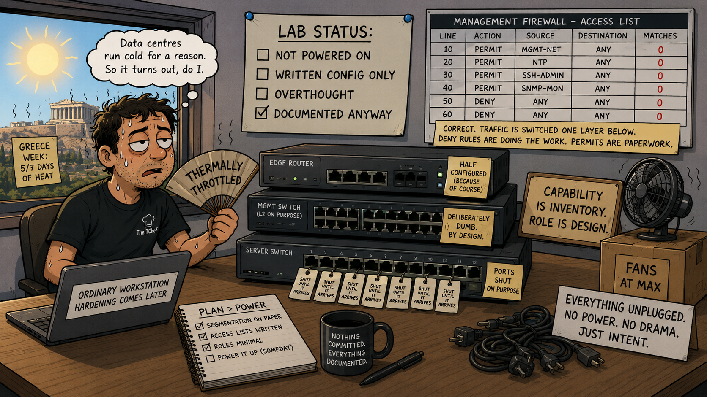

The most interesting thing I wrote this week is an access list that, most of the time, does nothing at all.

That's not a complaint. It took me a while to work out why it's correct.

It also took me longer than it should have, because five of this week's days were spent in Greece, where the ambient temperature made a convincing argument that thinking is an optional activity. Data centres run cold for a reason. So, it turns out, do I. Progress this week was thermally throttled — sustained clock reduced, workload deferred, fans at maximum and achieving nothing.

Some work happened anyway. Here it is.

## Configuration, on paper

Card 5 is where the design turns into commands. One document, a section per device, and the configuration shown as annotated excerpts rather than a paste-ready script — the load-bearing lines with a short note on why each one is there. A script tells you what to type. This is meant to explain what you're doing, which is a different document with a different job.

The core switch section is finished. Hostname, the three VLANs, routing switched on, and the three gateway interfaces that let the segments talk to each other.

The part I like most is the interface policy: only two ports come up in Phase 1. The uplink to the management switch, and the transit link to the edge router. Every server port stays administratively shut until the device on the other end is actually introduced to the design.

It's a small thing that costs nothing now and saves an afternoon later. A port that's up with nothing behind it is an invitation nobody remembers sending.

## Capability is not a role

The management switch is a 3560CG, and it can do layer 3 — routing, filtering, the lot. I checked, specifically so I could say I'd checked.

It's going to stay a dumb layer 2 switch anyway.

All routing and filtering lives on the core. One routing authority, one place to reason about, and the switch sitting closest to the most sensitive segment in the lab runs the smallest amount of function it can get away with. Everything it *could* do is something that could be misconfigured, or reached, or forgotten about.

The distinction worth writing down: knowing a device is capable of something is not a reason to make it responsible for something. Capability is inventory. Role is design.

## The access list that mostly doesn't run

Now the interesting part.

An access list on a switch interface is stateless. It has no memory of conversations — it looks at each packet on its own and decides, with no idea whether that packet is a reply to something you allowed thirty seconds ago. Stateful filtering, the kind that tracks a session and lets the return traffic home, happens elsewhere. On this lab's edge router, specifically.

Then there's the second thing, which took longer to see. The privileged workstation and the hardware controllers all live in the management VLAN together. Traffic between them is switched inside the VLAN — it never goes up to the gateway interface where the access list is attached. The list simply doesn't see it.

So what's the list actually doing?

The `deny` lines are doing the real work: keeping every other segment out of management. That's the boundary, and it's enforced exactly where it should be, at the point where traffic tries to cross between segments.

The `permit` lines are doing something else. They're not letting the workstation through — the switch was already doing that, one layer down, without consulting anyone. They're a written statement of sanctioned intent: *this* origin, to *these* destinations, is the access we've agreed exists. When something moves out of the VLAN later, or a rule needs to be defended in a review, the intent is already on the record.

I only spotted this because of a firewall question I got wrong in an interview once — one of those questions designed to find out whether you understand what stateless means or just recognise the word. That one stung enough to stick, which is the useful kind of stinging.

## Lanes in the address range

Smaller, but it'll pay off. The static range in the management segment is now divided into lanes: admin workstations at .10–.19, hardware controllers at .20–.49, device logins at .50–.99.

The point isn't tidiness. It's that an address alone now tells you what kind of thing you're looking at, which makes a future rule easier to write and a future log easier to read. The privileged workstation took 10.10.0.10.

## A clean workstation, honestly described

That workstation is being reinstalled this week. Fresh install, nothing carried over, which is convenient — no old configuration to reconcile, and its address is assigned from scratch.

It is also, right now, an ordinary laptop. The hardening — hardware keys, the full privileged-access treatment — is Phase 3 work. In Phase 1 it's a normal workstation carrying the role of trusted origin, and the document says so in those words.

Second time I've written a sentence like that in as many months. The alternative is a design that describes a machine I don't have yet, which would read better and help nobody.

## Half a router

The edge router is partly drafted — the internet-facing interface and the transit link to the core. Address translation, firewall, and the return routes are still to come.

There's also a quirk in how this particular router handles some of its ports that I'd rather discover on the bench than in the document. It's noted, and it waits for the day the equipment is actually powered up.

Which is getting close now. The configuration exists on paper, in order, with the reasoning attached. What it hasn't yet met is electricity.

That happens on a bench day, in a room that is not thirty-eight degrees, with the fans doing something useful for a change.

---

*I'm Ioannis — an IT operations, systems, and networking engineer based near Stockholm. The Itchef Hybrid Project (IHPC) is a real hybrid infrastructure lab, built and documented in public. Repo: [github.com/TheITchef/IHPC](https://github.com/TheITchef/IHPC) · [LinkedIn](https://www.linkedin.com/in/ioannis-mintzivyris-a1b77873/)*
