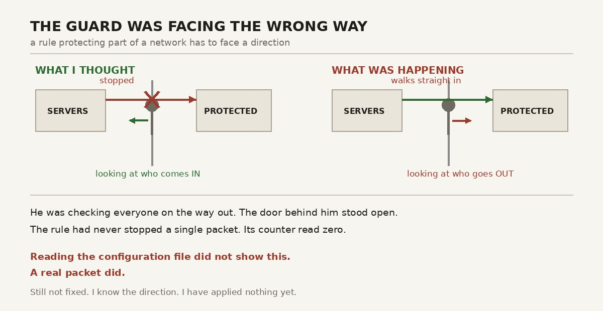

My network had a guard facing the wrong way.

He was checking everyone on the way *out*, very carefully, with a clipboard. Behind him the door stood wide open. Anyone from the servers side could walk straight in, take what they liked, and leave again while he was busy checking the caterers.

He had been doing this since the day I switched the equipment on. I walked past him several times and thought: good, security.

## Fault one, and fault two

I design this lab with AI help. I say so often, and this week is why.

**Fault one is the guard.** A rule that protects part of a network has to face a direction. It can check what comes in, or check what goes out. Mine was pointed at the exit.

**Fault two is shorter.** The design explains, in great detail, how replies from the internet would find their way back to my servers. It never says how anything gets out in the first place. Two pages about the journey home. Nothing about leaving the house.

The result: a lab that could be broken into, but could not order a pizza.

Both faults are in chapter four of any networking book. Neither is unusual. One of them I reviewed myself, several times, with the calm confidence of a man marking his own homework and giving it a good grade.

## The part that matters

The guard looked fine. Right command, right place, and a paragraph beside him explaining exactly what he was supposed to do. Read the configuration file and nothing looks wrong. Nothing is wrong! It says so, right there.

Then a real packet arrived. I sent it from the servers segment, which should never be able to reach the protected one. The protected one answered in two milliseconds. Cheerfully. Like a guard dog fetching slippers for a burglar.

So here is what I learned, and I think it is the useful part:

AI help is not unreliable. It is **not perfectly reliable**, which is much more annoying to work with.

Unreliable would be easy. You would check everything, because you would trust nothing, and you would sleep well. Not perfectly reliable is harder. Most of what comes back is good, so your guard drops — and then the one wrong answer walks past wearing the same confident hat as all the correct ones. Same words. Same tidy formatting. Same tone of voice.

You cannot catch that by feeling. I have now tested this personally.

## Which is the whole point of the lab

I did not build a homelab to get a network. You can buy a network. Mine has fewer features, more fan noise, and a heating bill.

I built it to become the person who can check the work.

That is not a noble idea. It is a practical requirement with an awkward condition attached. To check a design about segments, routing and access rules, I have to actually understand segments, routing and access rules. Otherwise I am not checking anything. I am agreeing with a confident paragraph, and finding out the truth later, from a packet, in public.

So: no more building for a while. Back to the basics of those exact topics, until I can read a configuration and *know*, instead of assuming with good posture.

This is not a pause in the project. It is the project. The equipment is the excuse. The ability to check it is the real thing being built.

## About the colleague I am about to fact-check

To be fair: I would be nowhere near this far alone. Design work moves faster. The documents are better than anything I would write at midnight. Explanations arrive at 2 a.m. without sighing, checking the time, or mentioning that they have a family.

But there is a version of this arrangement where you hand over the thinking, accept the polished answer, and end up with infrastructure you cannot defend in a room with one person who knows the subject. That version looks exactly like mine from the outside. The difference only appears when somebody asks a second question — or when a packet does, which is ruder and better timed.

I want the other version. Use the help to go faster and further than I could alone, then be sharp enough to catch what comes back wrong. Not as a polite nod towards care. As a real skill, with evidence, a test plan, and a spare laptop carried from segment to segment like a very small and very confused expert witness.

The good results start on the day I can spot the mistakes reliably. Until then: reading.

## Where things stand

One fault found and fixed. One fault found, fully understood, and still happily broken. I know which way it should face. I know the extra control it needs. I have applied neither. The documents still describe the wrong version, and that gets corrected openly, not quietly at 3 a.m. while nobody is looking.

There is an old saying that the more you learn, the less you know. I do not agree. What really happens is that the edges get sharper. A year ago I could not have written the test that caught this, because I did not know enough to know what to look at.

The reward for learning something is not confidence. It is a more accurate list of what you have not learned yet.

Mine gained two items this week, both with chapter numbers on them. The guard keeps his job. He is simply going to be turned around, and given a colleague.

---

*I'm Ioannis — an IT operations, systems, and networking engineer based near Stockholm. The Itchef Hybrid Project (IHPC) is a real hybrid infrastructure lab, built and documented in public. Repo: [github.com/TheITchef/IHPC](https://github.com/TheITchef/IHPC) · [LinkedIn](https://www.linkedin.com/in/ioannis-mintzivyris-a1b77873/)*
