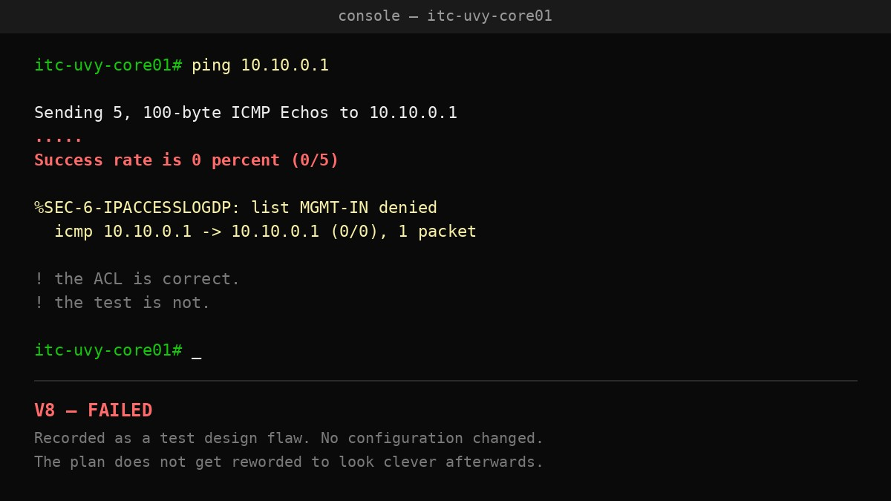
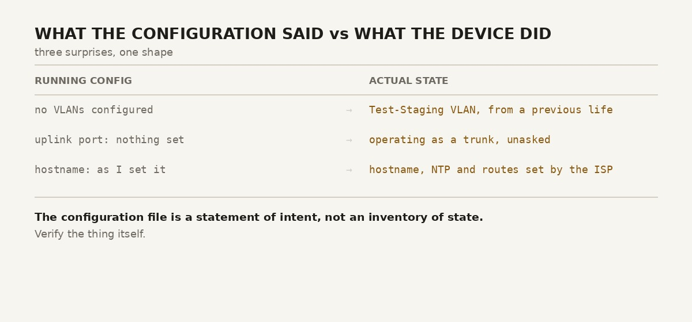

The firewall denied my ping. My ping. From my own console, on my own switch, to my own gateway.

It was right to. That turned out to be the most instructive thing that happened all night.

Tonight was the first powered bring-up of the Phase 1 network fabric. Three Cisco devices — a core switch, an edge router, a management switch — brought up in sequence from erased baselines, configured to the approved design, and tested against the 27-item validation plan I wrote weeks ago while the hardware was still asleep. No hosts attached. The fabric is deliberately empty.

Both fabric links came up and verified. Roughly half the plan executed. Everything saved.

And six things went differently than written, which is the interesting part.

## The test was wrong, not the network

Validation test V8 pings each segment gateway from the core switch console. Two passed. The management gateway failed, and the switch politely logged the drop.

The cause is the management access list, which denies inbound traffic by default — that's the entire point of it, and it's the strictest boundary in the design. Traffic sourced from the console arrives *inbound* on that interface. So the rule caught it and dropped it, exactly as specified.

The network behaved correctly. My test did not. I had written a test that could not pass against a design I had deliberately made that strict.

The tempting fix is a small permit line, at which point the test goes green and the boundary has a hole in it for the sake of my own convenience. The other tempting fix is to quietly reword the test so it looks like it always meant something else.

I did neither. It's recorded as a test design flaw, the configuration is untouched, and the test gets redesigned in the next revision of the plan. A validation plan is a record of first contact with reality. Editing it afterwards to look clever defeats the entire purpose of having written it in advance.

## The devices knew things the configuration didn't say

Three separate surprises tonight share one shape: the running configuration looked clean while the device was doing something else entirely.

**Erased switches weren't empty.** Both switches showed pristine configurations and were still carrying VLANs from a previous life — one of them a "Test-Staging" VLAN I certainly didn't create. The VLAN database doesn't live in the configuration file. It lives in `vlan.dat`, a separate file in flash, and a configuration erase leaves it untouched. A real factory reset needs the erase, the deletion of that file, and a reload. Found only because I checked `show vlan brief` instead of trusting `show running-config`.

**A port trunked itself.** The management switch's uplink came up as a trunk before I had configured it at all. Its factory default negotiates: it won't ask to become a trunk, but it agrees when asked, and the core switch's explicit trunk configuration asked. Harmless here, since both ends are mine. Less harmless as a general condition — a port that will trunk on request is a port that someone else can turn into a trunk, which is the mechanism behind VLAN-hopping attacks. The part that bothers me more is that the running configuration showed nothing while the port ran as a trunk. Both ends are now explicit, with negotiation switched off.

**The ISP configured my router.** After erasing it, the router booted, requested an address, and the reply quietly set its hostname, pointed it at a time server, and installed routes. None of that was my decision. The hostname and time server are gone. The default route is genuinely needed and stayed.

Three different mechanisms, one lesson: the configuration file is a statement of intent, not an inventory of state. Verify the thing itself.

## Where the design met the hardware

The design called for the router's transit port to be a routed port — a switch port converted to behave like a router interface so it can hold an address directly. The command was refused. Those ports on this platform are Layer 2 in hardware; there is no routed mode to convert to.

The address went onto a virtual interface instead, with the physical port as an access port in that VLAN. Electrically identical, different implementation.

The design document was wrong about the platform. It's now at version 1.1, with the correction made and the original reasoning left visible next to the constraint that overruled it. Deleting the first answer would hide why the second one exists.

One more ordering lesson, cheaply learned: the zone-based firewall starts denying traffic between zones the moment an interface joins one. My document listed the zones and their membership before the policy that permits anything. Applied in that order, the deny goes live before any permit exists, and everything stops. I built it backwards — rules first, membership last. On a device I'd been managing over the network rather than by console cable, that ordering error is a lockout.

## Where it stands

Half the validation plan run. Both fabric links verified. Two documents merged: a record of what actually happened at the bench, and the design corrected to 1.1.

The plan survived contact with the hardware, mostly. What it's worth is exactly the places it didn't.

---

*I'm Ioannis — an IT operations, systems, and networking engineer based near Stockholm. The Itchef Hybrid Project (IHPC) is a real hybrid infrastructure lab, built and documented in public. Repo: [github.com/TheITchef/IHPC](https://github.com/TheITchef/IHPC) · [LinkedIn](https://www.linkedin.com/in/ioannis-mintzivyris-a1b77873/)*
