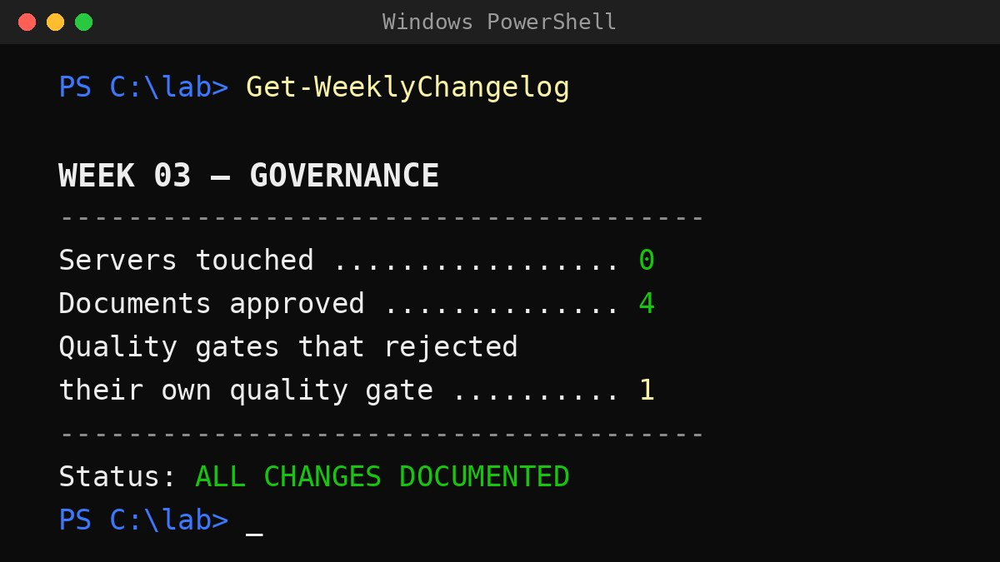

Last time I promised you the VLAN architecture. Welcome to a living project: plans changed mid-week, and the VLANs graciously agreed to wait. This week the lab got something less photogenic and more important — documentation. The business-critical first step nobody screenshots.

Here's the confession: I didn't touch a single server this week. Not one power button. The rack has never slept better, and it was still the most productive week of the project so far.

## Rules before racks

Most homelab content jumps straight to the fun part: install the hypervisor, screenshot the dashboard, collect the likes. I've done it that way before. What you get is a pile of things that work, held together by memory and hope — and six months later, nobody (including you) can explain why anything is configured the way it is. That's not an environment. That's an incident with a calendar invite.

So before any infrastructure exists, four documents now do: a project charter, a documentation standard, a change-management SOP (a written rule for how every change gets proposed, reviewed, and approved), and a master document tying the map together.

Boring? Slightly. But in every environment I've ever supported, the shops that recovered in minutes instead of days weren't the ones with better hardware. They were the ones who could answer "what changed, when, and why?" without a séance.

## The part where it broke (immediately)

Because this is a living project, here's the mess along with the polish: the change-management SOP failed its own first review. The document defining how work gets reviewed went through that review — and got sent back for a rule it hadn't covered. The first thing my quality gate ever rejected was the quality gate.

I choose to find that funny. It's also the system working: the gap was caught at a defined checkpoint, fixed, re-reviewed, and approved — with a paper trail. Things will always break. Discipline isn't preventing every failure; it's making failure boring, documented, and recoverable.

## Meanwhile, in night school

Side quest: I'm also relearning Git — the version-control tool this project runs on — properly this time. Not "I can usually make it do the thing," but actually understanding what a branch *is*. Mental models over memorised incantations. Humbling? Yes. Necessary for where I'm steering my career? Also yes.

(This week's tuition fee: one hour of my life to discover PowerShell quietly eats the curly braces in Git commands before Git ever sees them. One set of quotation marks fixed it. We move on, wiser.)

## The honest ending

There's still an open item in the repo: an old, unlabelled bundle of uncommitted work from *before* the rules existed — a little museum exhibit of exactly the working style this week was built to end. It gets cleaned up through the new process, properly.

And that's the whole point. A polished blog would show you a spotless repo. A living project shows you the drawer of loose cables — and then cleans it out with a documented procedure.

The servers get their turn. And when they do, every change from day one will land on a foundation that can explain itself. Worth a quiet week. The rack agrees.
