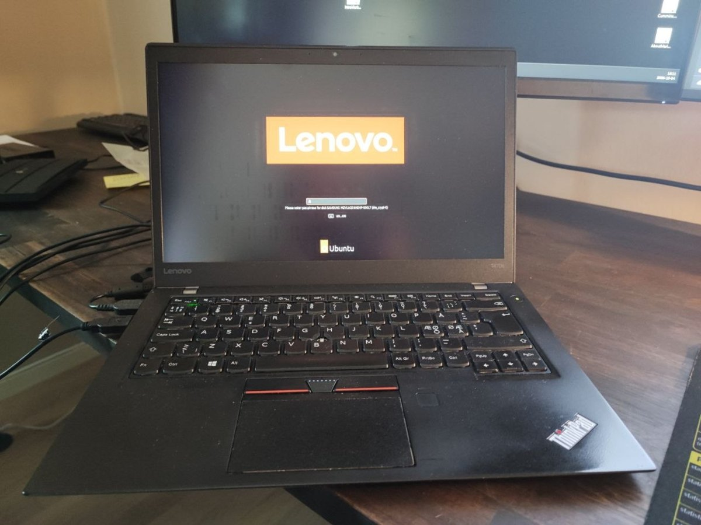
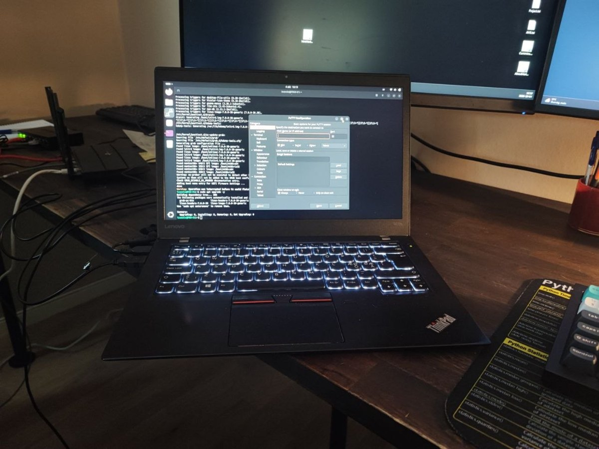
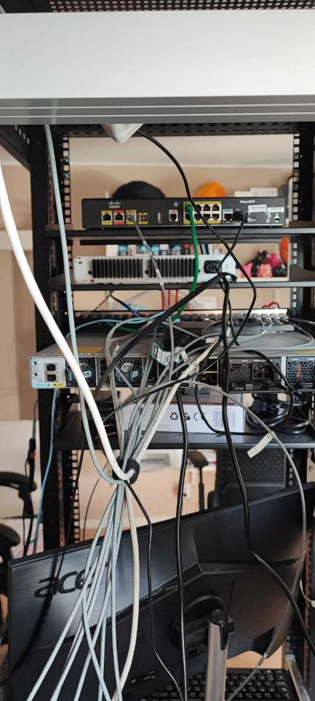
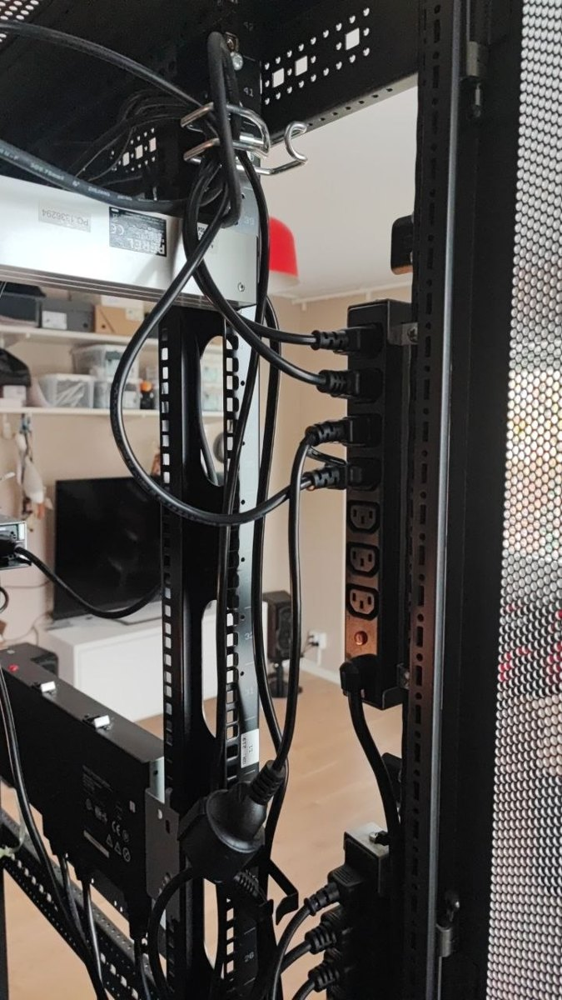
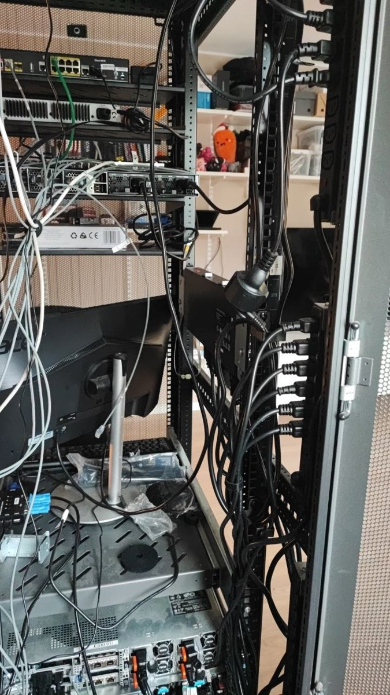
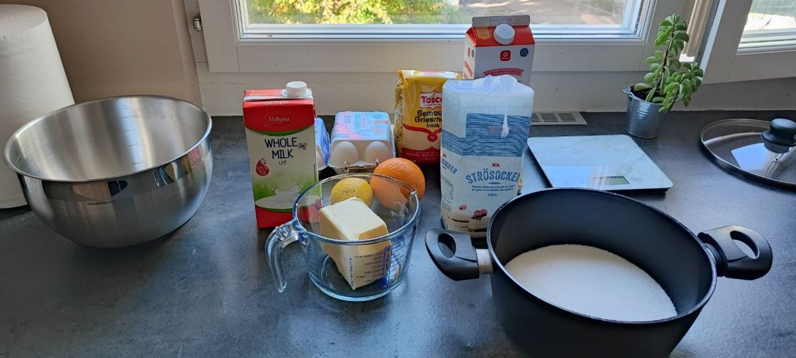
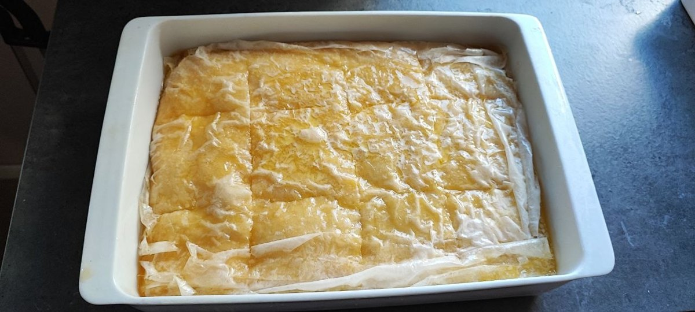
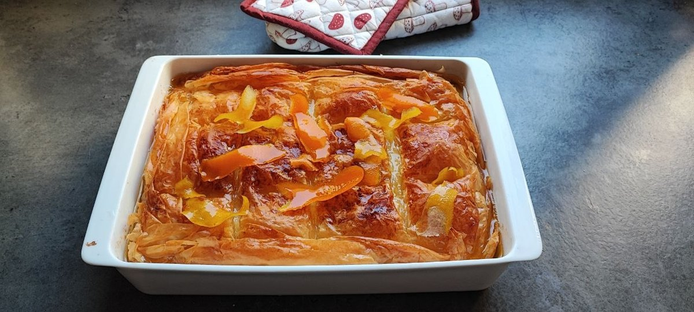
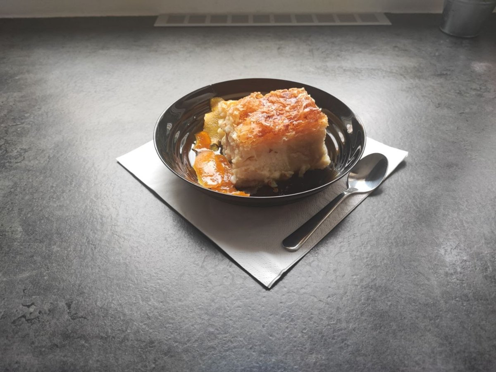

This one is late. I normally post on Fridays, I said in advance that this week would slip, and here we are on Sunday. The pie took longer than expected, which will make sense shortly.

Three jobs this week. I did not plan a theme and got one anyway: **keep things apart**.

## One: a laptop that is deliberately alone

The admin machine got rebuilt. Fresh Ubuntu 26.04.1, full disk encryption, and almost nothing installed on it.

For months this has been an ordinary laptop doing an important job, and I have written about that discomfort more than once. It is the machine that reaches the management side of the lab — the part that controls everything else — and until this week its only real protection was that I had to physically plug it in.

Now it asks for a passphrase before it will boot at all. If it walks out of the flat in somebody's bag, it is a brick with a nice keyboard.

The second decision is the one people find odd: it is kept off the network. Not firewalled off. Off. It connects when I decide it connects, for the task I decided it would do, and then it goes back to being a laptop with a terminal and a serial program and not much else.

There is no clever technology in that. The separation is physical and it is a habit. But a machine that is only on the network sometimes has a much smaller surface than a machine that is always on it, and the browser that reads the news is not the same machine that can power-cycle a server.

Minimal applications for the same reason. Every program on there is something that can have a bad week.

## Two: the cables finally have lanes

Here is what the back of the rack looked like before.

That is not a photograph I enjoy publishing. It is honest. Equipment arrived over months, each cable took the shortest route available at the time, and the result is a knot where power, network and monitor cables all live together and none of them can be traced.

This week it started getting lanes. All power now runs down the left side, where the power strips are. Network and the other low-voltage cables will move to the right side, which is next week's job.

Why bother, in a flat, where nobody inspects anything?

Three reasons, and the third is the real one. Power cables and data cables sitting against each other for long runs is not ideal — mains cabling radiates, data cabling is the thing listening, and while you will rarely see a problem at these lengths, it is a free thing to avoid. Second, serviceability: if every power cable follows one path, pulling a dead power supply does not mean disturbing six network connections on the way.

And third: traceability. A cable you can follow with your eyes is a cable you do not have to unplug to identify. The whole reason last month's network faults were hard to find is that I could not see what was true — and that problem is not limited to configuration files. A rack where you cannot follow a cable is a rack that will lie to you at midnight.

It is not finished. The left side is done, the right side is next, and there is a monitor in there that needs to leave.

## Three: a pie that fails if two things touch wrong

And then, because it was Saturday and I wanted to cook something from home, galaktoboureko. Semolina custard in filo pastry, soaked in syrup. It is the dessert I grew up with.

It has one rule that matters more than all the others, and it is a separation rule.

**The syrup must be cold and the pie must be hot. Never both hot.**

If you pour hot syrup onto a hot pie, the pastry drinks it all at once, goes soft, and you get a sweet wet sponge where you wanted crisp layers. The temperature difference is what makes the syrup soak into the custard while the filo stays crisp. Two things that must meet, kept deliberately in different states until the moment they do.

The layering is the same instinct. Seven sheets on the bottom, each one buttered on its own, overhanging the edges. Not a lump of pastry — distinct sheets that stay distinct, because the whole texture depends on them not merging.

And then, the part that delayed this post: you cannot cut it while it is hot. Cut it early and the syrup runs out into the tray and you are left with a dry pie sitting in a puddle of its own point.

So you wait. Again. I have now written about waiting for food three weeks running, and I promise the networking has an equivalent for everything.

## The recipe

Adapted from a standard Greek recipe, with my own changes — 250 g butter for the filo rather than 200, and baked at 180 °C conventional.

**Syrup:** 700 g sugar, 500 g water, 1 cinnamon stick, 2 squeezed lemon halves. Bring to the boil, stop stirring, 5 minutes on medium. Remove the lemon halves. Leave to cool completely — this is not optional.

**Custard:** 2 L milk, 200 g sugar, 4 eggs plus 2 yolks, zest of 1 lemon, 200 g fine semolina, 2 vanilla, 1 cinnamon stick, 60 g butter.

Keep one cup of the milk aside. The rest goes in a pot with half the sugar, the cinnamon stick and the lemon zest, and goes on to heat. Beat the eggs and yolks until light, add the vanilla and the remaining sugar, and keep beating until the sugar has dissolved. Beating them properly also removes the eggy smell. Fold in the semolina and the reserved cup of milk.

Take two cups of the hot milk and pour it slowly into the egg mixture, stirring, so the eggs warm up instead of scrambling. Then pour the whole lot back into the pot and stir until it thickens. Off the heat, stir in the 60 g of butter. Remove the cinnamon stick. Cover with cling film touching the surface so it does not form a skin, and let it cool.

**Assembly:** melt 250 g butter — melted, not browned — and let it cool until it is just starting to thicken. Butter a tray, 36–38 cm round or 38 × 28 cm. Lay seven sheets of filo, buttering each one separately, with plenty hanging over the edge. Custard in, fold the overhang back over, more buttered sheets on top. Score the portions before baking, or you will never cut it cleanly afterwards.

**Bake** at 180 °C conventional until golden, roughly 45–50 minutes. Fan oven: 160 °C, middle shelf, about 50 minutes.

Then the cold syrup over the hot pie, and leave it alone until it is cool.

## Next

The right side of the rack, where the network cables are going. Which means labels, and a decision about what gets a label and what does not.

Keeping things apart turns out to be most of the job, in the rack and in the oven.

---

*I'm Ioannis — an IT operations, systems, and networking engineer based near Stockholm. The Itchef Hybrid Project (IHPC) is a real hybrid infrastructure lab, built and documented in public. Repo: [github.com/TheITchef/IHPC](https://github.com/TheITchef/IHPC) · [LinkedIn](https://www.linkedin.com/in/ioannis-mintzivyris-a1b77873/)*
