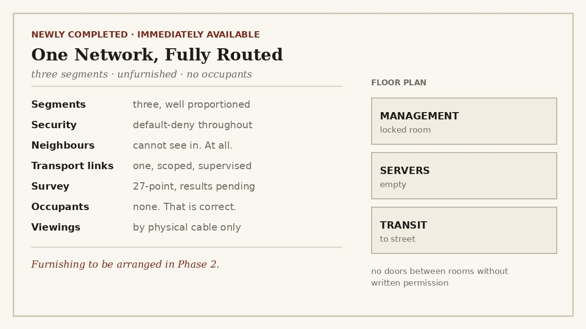

Six cards. One phase. Zero hosts. Let me explain.

Phase 1 of the IHPC homelab was the network layer — the plumbing before anything useful runs on it. Three devices: a core switch that routes, an edge router that talks to the internet and trusts no one, and a management switch that quietly does one job. Between them: three segments, a default-deny on management, NAT scoped so only servers get out, and a firewall whose entire personality is "no."

The cards went in order, each one a document before it was a command:

- **Physical port map** — what plugs into what. Boring. Load-bearing.
- **Segmentation** — who's allowed to talk to whom. Mostly "no."
- **VLAN & IP plan** — the addresses. The part where you measure twice.
- **Routing & ACLs** — where traffic goes, and where it doesn't.
- **Device configuration** — the cards above, turned into actual config.
- **Validation & handover** — proving it works. Sort of. Read on.

## Today: the card where I validated a network I couldn't turn on

Card 6 was validation. The catch: the lab was powered off and I was working remotely. So I wrote a full test plan — 27 tests, exact commands, expected results — for a network I could not touch, run against hardware that was asleep.

This sounds absurd. It mostly wasn't. Writing down what "correct" looks like is design work — it caught two things I'd have tripped over at the bench. And a validation plan written ahead of time is a checklist you follow, not something you invent at 21:00 in front of a blinking console.

Then it got philosophical.

**You can validate an empty fabric.** No servers exist yet, so "does server A reach server B" isn't a test — it's fiction. But you can still prove the routing works, the denies hold, the NAT scopes correctly. You test the plane, not the passengers. Where a test needs a host that doesn't exist, a laptop on a test port stands in — and the plan says so out loud.

**Some tests prove too much.** One test — "can management reach the internet?" — fails for three separate reasons at once. Tempting to write it up as a clean result. It isn't clean, and pretending otherwise is lying to future-me. So I wrote it down as messy, and pointed at the tests that isolate each cause.

**Record what happened, not what you wish happened.** When a test fails at the bench, the reflex is to fix the config and quietly edit the plan so it looks like it always passed. Don't. The plan is a record of first contact with reality. Fix the config as its own change, with its own trail.

## The most honest paragraph I wrote all day

The break-glass admin host — the machine that's supposed to be a locked-down, single-purpose privileged access workstation — is currently a normal Ubuntu laptop with a web browser and opinions.

I could have called it a "PAW" in the docs and moved on. Instead I wrote what's actually true: the only real control today is physical — it can't reach the lab unless I deliberately plug it in, and that gets logged. Hardening it properly is a future task, filed as a future task, not quietly claimed as done.

A homelab dressed up as more than it is fools exactly no one who reads closely. And the whole point of IHPC is that it's built to be read closely.

## Where Phase 1 leaves things

A routed, filtered, documented, completely empty network. Nothing runs on it yet — and that's correct. It's a foundation, not a finished house. Phase 2 gets to put the furniture in.

The fabric is built and plausible. It is not yet proven — that happens when the lab powers on and I run all 27 tests in front of the hardware, filling in the column I deliberately left blank.

Built. Documented. Untrusted until tested. Onward to Phase 2.

---

*I'm Ioannis — an IT operations, systems, and networking engineer based near Stockholm. The Itchef Hybrid Project (IHPC) is a real hybrid infrastructure lab, built and documented in public. Repo: [github.com/TheITchef/IHPC](https://github.com/TheITchef/IHPC) · [LinkedIn](https://www.linkedin.com/in/ioannis-mintzivyris-a1b77873/)*
