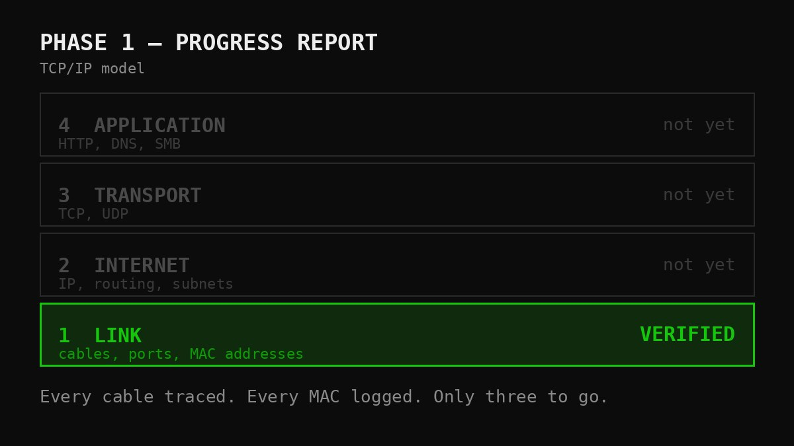

Good news: I touched the servers this week.

Less good news for anyone expecting fireworks: I touched them to read their labels.

Phase 0 is closed. The rulebook exists, the change process works (it even rejected itself once, but we've discussed that). So this week the project crossed into Phase 1 — the network. And Phase 1 does not begin with VLANs, routing, or any of the things that look good in a screenshot. It begins with the least glamorous question in infrastructure: *what is actually plugged into what?*

## The unglamorous truth of Layer 1

Every device in the rack got inventoried properly this week. Model, role, management interface. Every network interface written down with its MAC address — the hardware address burned into each port, the thing that lets you prove a cable goes where you think it goes. Then every physical link verified by hand: this port, that switch, that port.

It is exactly as thrilling as it sounds. It is also the difference between a network you can design and a network you can only guess at. You cannot write an addressing plan for interfaces you haven't confirmed exist. Well — you can. Once. And then you spend an evening discovering that Gi1/0/12 was never connected to anything, and that the "spare" cable behind the rack has been doing load-bearing work this whole time.

Ask anyone who has traced a cable at 2 a.m. with a torch in their teeth: Layer 1 problems don't announce themselves as Layer 1 problems. They arrive disguised as software mysteries, and they waste your entire evening before revealing themselves as a plug.

## The honest bit

I'll be straight — this was a light week. Other disciplines had my attention, and the lab got the hours that were left rather than the hours I'd have liked.

Which is, I think, worth writing down rather than hiding. A living project runs at the speed of a real life: some weeks you close a phase, some weeks you label ports and call it an evening. The unglamorous cataloguing is exactly the kind of work that quietly gets skipped when time is short — and it's exactly the work that makes everything after it possible. Doing it anyway, in a slow week, is the whole discipline in one small act.

No IP addresses assigned yet. No VLANs. Those come next, and they'll come faster because the foundation underneath them is now documented rather than assumed.

The rack still hums. It just hums with better paperwork.

*Full lab documentation lives on [GitHub](https://github.com/TheITchef/IHPC). I'm an IT operations, systems, and networking engineer based in Stockholm. Find me on [LinkedIn](https://www.linkedin.com/in/ioannis-mintzivyris-a1b77873/).*
