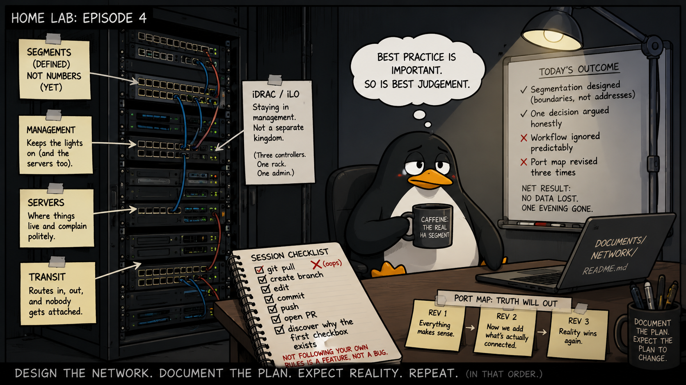

This week's deliverable is a document with no IP addresses in it. No VLAN numbers either. It draws three lines and explains why each one is there, and that's the whole thing.

That's Card 2 of Phase 1: the segmentation design. It's the first card in this project that decides something rather than records something. The port map before it was archaeology — walk the rack, write down what's plugged into what. This one asked a question with more than one defensible answer.

## Three segments, no numbers

The document defines three segments for Phase 1. Management, for the interfaces that administer the equipment. Servers, for the machines that do the work. Transit, for the handoff between the lab and the internet. Each gets a purpose, a boundary, and a written reason.

What it deliberately doesn't get is numbers. No VLAN IDs, no subnets. Those are the next card, and keeping them out of this one is the point — decide what the segments are *for* before deciding what to call them. Once a subnet is written down, it develops opinions about the design.

It also writes down what's not in scope and what's deferred. A segmentation design that only lists what exists is half a document; the useful half is the part that says "clients and DMZ come later, and here's why they're not here yet."

## The decision worth arguing about

Here's the one that took the longest.

Servers have a small computer inside them, separate from the actual server, that lets you manage the machine even when it's powered off. Dell calls theirs iDRAC, HPE calls theirs iLO; the generic term is a BMC — baseboard management controller. It can power the box on, reinstall it, and watch the screen. It is, functionally, the keys to the building.

Larger organisations usually give these their own segment, separate from switch and router logins. The reasoning is solid: BMCs are rarely patched, ship with cheerful defaults, and hand over total control of a machine to anyone who reaches them.

I put them in the shared management segment anyway.

Three controllers. One rack. One administrator. Both segments would have lived on the same switch and left through the same uplink, which means the separation would have been a diagram convention rather than a boundary. The controllers are restricted by rules inside the segment instead, and splitting them out stays on the table for Phase 4, when there's a hardening pass and something more than a drawing to enforce it.

The part I care about isn't which answer I picked. It's that the answer was argued against the size of this environment rather than copied out of a reference architecture. A design that ignores its own scale is just someone else's design wearing your hostnames.

## The uncomfortable sentence

Management in this lab is not reachable from the network. There's no jump box, no VPN into it, no route from the server segment. It is reached from one machine: a dedicated laptop plugged directly into the out-of-band switch.

The document also says, in writing, that this laptop isn't hardened yet. That happens in Phase 3. Until then, the single port that reaches the most sensitive segment in the lab has an ordinary, unhardened endpoint on the end of it.

I could have left that out. The design would have read better. But a design document that only describes the intended state is a brochure, and the gap between intent and today is exactly the thing that gets forgotten. It's written down, it has a phase attached, and it'll be closed on record rather than quietly.

## Where the process caught me

Now the part I'd rather not type.

My own written ritual is that every session starts with a pull from the repository — before anything, no exceptions. This session started with documents pasted into a chat instead of a terminal, and because it didn't *feel* like a session that touched code, I skipped it.

Main had moved. The same port map revision had already been merged from another thread. I didn't know that, so I branched, edited, committed, pushed, opened a pull request, and walked directly into a merge conflict with work that was already done. The branch was abandoned and deleted.

Nothing was lost except an evening. And the honest reading is that the process worked — the conflict surfaced at the pull request, which is where it's supposed to surface, and nothing broken reached main. That's the argument for having a process at all: not that it prevents mistakes, but that it makes them cheap and visible.

Except the ritual existed specifically to stop this one. It didn't fail; it wasn't run. A rule you follow when it's convenient isn't a rule, it's a preference — and the moment it stops being convenient is precisely the moment it was written for.

## Meanwhile, the rack disagreed

Smaller, but related: the port map went through three revisions in a single session, because every time I checked the document against the actual rack, the rack won. A workstation was cabled that the document called disconnected. The internet uplink had moved from the home router to an unmanaged switch feeding straight to the ISP. Temporary cables were doing permanent work, unrecorded.

None of it was dramatic. All of it would have quietly poisoned the addressing plan built on top of it. A document is only authoritative for as long as somebody keeps walking behind the rack with a torch and checking.

Numbers next.

---

*I'm Ioannis — an IT operations, systems, and networking engineer based near Stockholm. The Itchef Hybrid Project (IHPC) is a real hybrid infrastructure lab, built and documented in public. Repo: [github.com/TheITchef/IHPC](https://github.com/TheITchef/IHPC) · [LinkedIn](https://www.linkedin.com/in/ioannis-mintzivyris-a1b77873/)*