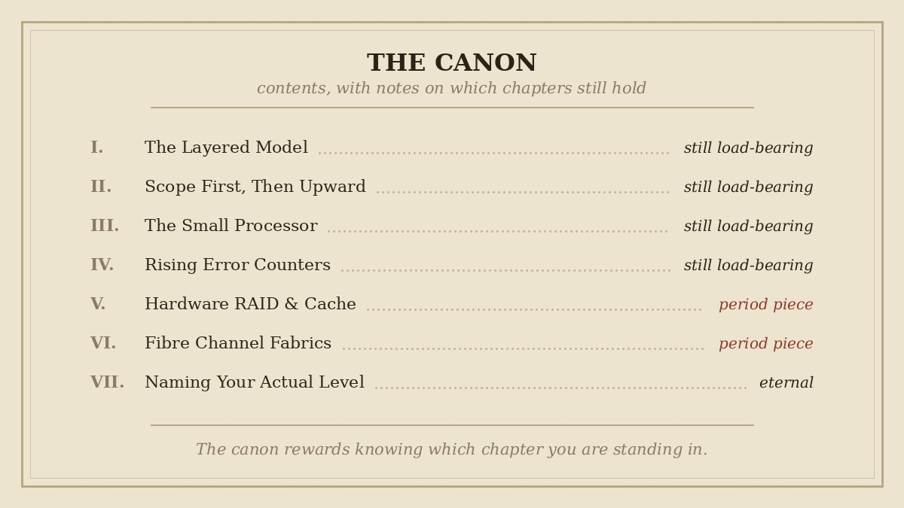

This week I have mostly been reading the classics.

Not Homer. The other canon — where a seven-layer model from 1984 is still the first thing anyone teaches, RAID levels are recited like declensions, and DORA is not a children's television character but the four-beat sequence by which a machine is granted an address. Discover, Offer, Request, Acknowledge.

The lab, meanwhile, sits exactly where I left it: configured on paper, reasoned about at length, entirely without electricity.

## Why go back to the canon

Six weeks of this project have produced documents that are intensely specific to my rack. Which VLAN, which port, which deliberately unhardened laptop. Useful, but bespoke — nobody else will ever read my addressing plan, and nor should they.

The canon is the opposite. It's the part every engineer shares, and it has to be available without notes, because the situations it applies to arrive unannounced and rarely at a convenient hour.

Knowing something and producing it under pressure are different skills. Only one is worth anything at three in the morning.

## Mostly one idea

Stripped down, the fundamentals are one idea wearing different clothes: establish the scope, then work upward from the physical.

One host or several? If several — same rack, same switch, same power feed? Several machines failing together isn't several faults. It's one fault upstream in a convincing disguise, usually power, the top-of-rack switch, or cooling.

Then you climb. Physical path first: link light, cable, optic, port not shut. Then switching: right VLAN, MAC learned, speed and duplex agreeing. Then routing: a real address rather than the one a machine assigns itself when nobody answers. Then names, which announce themselves with the most legible symptom in the trade — the address works, the name doesn't.

Rising error counters are the elegant case. They surface at the switching layer but they're the physical layer complaining one level up. The instinct to go back *down* a layer rather than forward is most of the skill.

None of it is difficult. All of it is easy to skip when someone is standing over you.

## The chapters that have aged

Some of the canon is eternal. The layered model. Scope first. The small independent processor on the motherboard that answers when the machine itself won't — its hardware event log names the failing component more often than staring does.

And some of it is a period piece.

Hardware RAID controllers with battery-backed cache, presenting one tidy volume to an operating system that has no idea how many disks are underneath: essential knowledge, and increasingly a description of mid-sized infrastructure rather than large infrastructure. At scale, redundancy moved into software across the fleet, and the controller's job shrank to passing raw disks through.

Fibre Channel fabrics are the same story further along — elegant engineering you'll meet in an enterprise data centre far more readily than a hyperscale one.

I know these the way you know a set text. I've read them carefully and can explain what they do. I haven't run a Fibre Channel fabric in production, and saying otherwise would survive exactly one follow-up question.

The canon rewards knowing which chapter you're standing in.

## The thing I keep relearning

There's a temptation, revising fundamentals, to aim for total recall — to be the person who answers instantly.

But they aren't a memory test. They're a method: the order you check things in, and the discipline to keep that order when guessing would be faster. Someone working up from the physical layer will find the fault. Someone who recalls every RAID level flawlessly and starts in the middle will find it eventually, via the scenic route.

And where the method runs out, the honest answer beats the confident one. Naming your actual level, then describing how you'd find out, isn't the weaker answer. It's the answer of somebody who can be trusted near production.

Which is precisely what this project has been arguing for six weeks — that a design must record what it cannot yet do, that a limitation named out loud beats one quietly omitted, that a laptop should be described as the ordinary laptop it currently is.

Apparently the principle applies to me as well as to my documentation. Rude of it.

The rack still has no electricity. In the meantime, the classics.

---

*I'm Ioannis — an IT operations, systems, and networking engineer based near Stockholm. The Itchef Hybrid Project (IHPC) is a real hybrid infrastructure lab, built and documented in public. Repo: [github.com/TheITchef/IHPC](https://github.com/TheITchef/IHPC) · [LinkedIn](https://www.linkedin.com/in/ioannis-mintzivyris-a1b77873/)*
