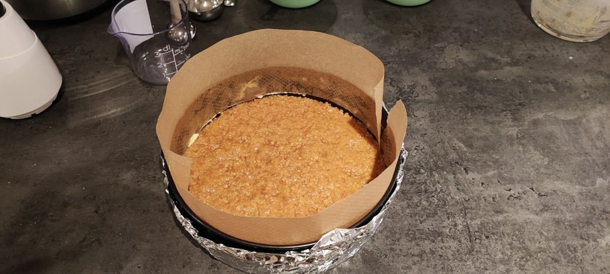
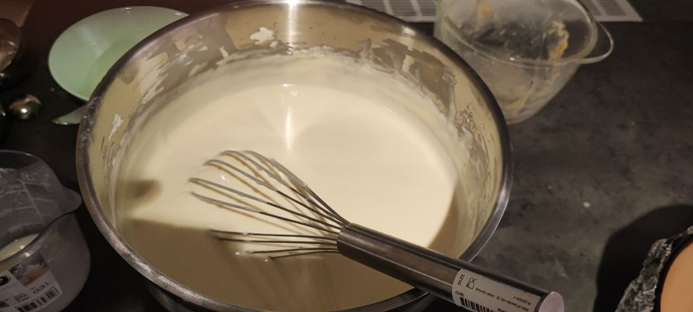
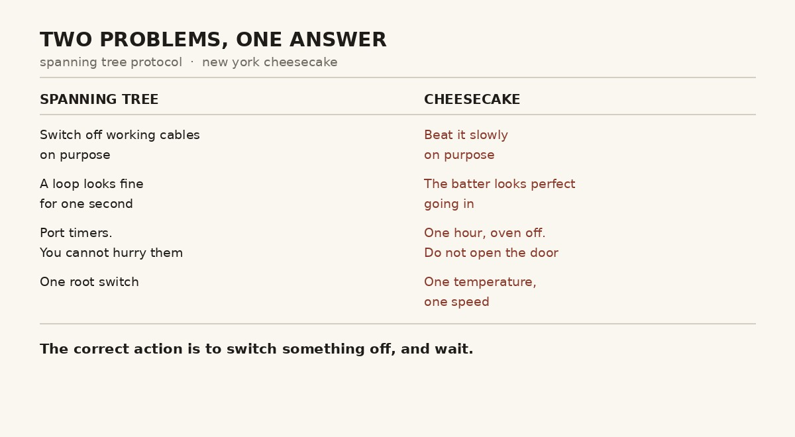
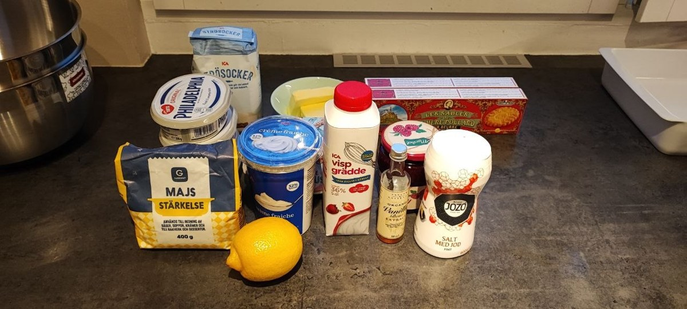

I have been writing under the name theITchef for a year now.

The IT half has been earning its keep. Switches, routers, access rules, a rack in the corner of the flat that hums. The chef half has been, frankly, decorative — a word I put in a domain name because it sounded good and because I like cooking.

This week the two halves met. I spent the week studying Spanning Tree Protocol and, in the middle of it, baked a New York cheesecake.

I did not plan for these to be the same task. They were.

When I get stuck on a technical topic I switch to something physical for a few hours. It is not procrastination, it is a different kind of thinking that usually hands back the answer for free. This week it handed back rather more than usual.

## What spanning tree does, in plain words

Networks like to have more than one cable between switches. If one cable dies, traffic takes the other. Good.

The problem is that a network with two paths has a circle in it. Certain traffic — the kind a switch sends when it does not yet know where something is — gets copied to every path. It goes round the circle. It comes back. It gets copied again. Within seconds the loop is running at full speed, every switch is drowning, and the network stops working entirely. Not "slow". Stopped.

Spanning Tree Protocol is the fix, and the fix is strange the first time you meet it.

The switches talk to each other, elect one of them as the root, work out the shape of the network, and then **deliberately switch off the extra paths**. The cables stay plugged in. They carry nothing. They sit there doing nothing until something breaks, at which point one of them wakes up and takes over.

The protocol's job is not to use everything you have. It is to decide what to turn off, and then to wait.

That waiting is the part people find annoying. A port does not start forwarding traffic the moment it comes up. It listens, it learns, it waits through timers, and only then does it carry anything. You cannot hurry it. If you could hurry it, it would occasionally forward into a loop it had not finished understanding yet, and you would be back to the drowning network.

Hold that thought.

## Meanwhile, in the kitchen

A New York cheesecake is a custard. It is mostly cream cheese, eggs, sugar and patience, and almost everything that goes wrong with one goes wrong for the same reason: somebody did more than was needed.

Beat the mixture hard and you fold air into it. The air expands in the oven, the cake rises, then it cools, and the surface tears open. A crack down the middle is not bad luck. It is a record of enthusiasm.

I work by hand, with a whisk. That sounds like the slow option and it is, but it also removes the biggest temptation in the room. A machine will happily whip your batter into something light and ruined while you look away for twenty seconds. A whisk only goes as fast as you decide to go, which means the restraint is yours rather than a setting.

Add the eggs quickly and the same problem arrives. They go in slowly, in three or four goes, mixed just enough to combine and no more.

Bake it hot and the edges set before the middle does. The middle then cooks while the edges overcook, and the whole thing splits.

And at the end, when it is baked, you turn the oven off, leave the door slightly open, and leave the cake inside for a full hour. Not because anything is still cooking. Because a custard that goes from a hot oven to a cool kitchen contracts too fast and tears. The gap in the door lets the heat leave slowly instead of all at once.

You are not doing anything during that hour. That is the technique.

## The same idea, twice

Here is what I noticed, standing in front of an oven I was not allowed to open.

**Both are solved by deliberately doing less.** Spanning tree switches off working cables on purpose. The cheesecake gets beaten slowly on purpose. In both cases the beginner's instinct — use everything, go faster — is the thing that destroys the result.

**Both punish you later, not immediately.** A loop looks fine for a second. An over-beaten batter looks perfect going into the oven. Neither tells you at the time. You find out when the network falls over, or when the cake cools and opens up like a dry riverbed.

**Both have waiting built in as a real step.** Port timers. Sixty minutes with the heat off. In both cases the waiting is not dead time around the work. It *is* the work. The temptation to skip it is exactly the same temptation in both rooms.

**Both need one authority, not several.** Spanning tree elects a single root switch and measures everything from it. A cheesecake has one temperature at a time and one speed at a time. Two ideas about who is in charge produces a loop in one case and a crack in the other.

**And both scale in ways that are not obvious.** My recipe is written for an 18 cm springform. I have a 23 cm one. You do not simply add more of everything — the guide gives different multipliers and different baking times, because a bigger cake is not a longer cake, it is a differently shaped heat problem. Networks are the same. What works with three switches does not simply continue working with thirty; you get different timings and different failure modes, and the person who assumes it scales linearly is the person who finds out.

## The cake

For anyone who wants it, this is what I made. Base quantities are for an 18 cm springform.

**Base:** 120 g biscuits, 60 g melted butter.

**Filling:** 400 g full-fat cream cheese, 120 g sugar, 200 g sour cream (or 100 g heavy cream plus 100 g yoghurt), 150 ml heavy cream, 2 eggs, 2 tbsp cornflour, 1.5 tbsp vanilla, juice of a quarter lemon.

**Topping:** 200 g raspberries, 40 g sugar, 1 tbsp water.

**Baking:** 180 °C for 30 minutes, then 150 °C for 40–45 minutes, then turn the oven off, prop the door slightly open, and leave the cake inside for a full hour.

For a 21 cm springform, multiply by 1.5. For 24 cm, multiply by 2 and give it 50–60 minutes at the lower temperature. For 15 cm, two thirds. The hour with the oven off and the door ajar never changes, whatever size you make.

Everything must be at room temperature before you start. Cold cream cheese does not blend smoothly, so you beat it harder to compensate, which adds air, which cracks the cake. The fault appears at the end. The cause was at the beginning, before you had even switched the oven on.

That one I have definitely met before, somewhere with cables in it.

## Back to the network

The cheesecake came out whole. The spanning tree material went in more easily afterwards, which is the usual pattern and still surprises me every time.

I am deep in switching fundamentals at the moment, going back over the basics properly after finding two faults in my own network design earlier this month. Spanning tree is on that list.

It turns out the hardest idea in it is not technical at all. It is that the correct action is often to switch something off and wait.

Dessert taught me that faster than the textbook did.

A year of writing under a name where only half of it was true. The oven has now settled the matter.

---

*I'm Ioannis — an IT operations, systems, and networking engineer based near Stockholm. The Itchef Hybrid Project (IHPC) is a real hybrid infrastructure lab, built and documented in public. Repo: [github.com/TheITchef/IHPC](https://github.com/TheITchef/IHPC) · [LinkedIn](https://www.linkedin.com/in/ioannis-mintzivyris-a1b77873/)*
