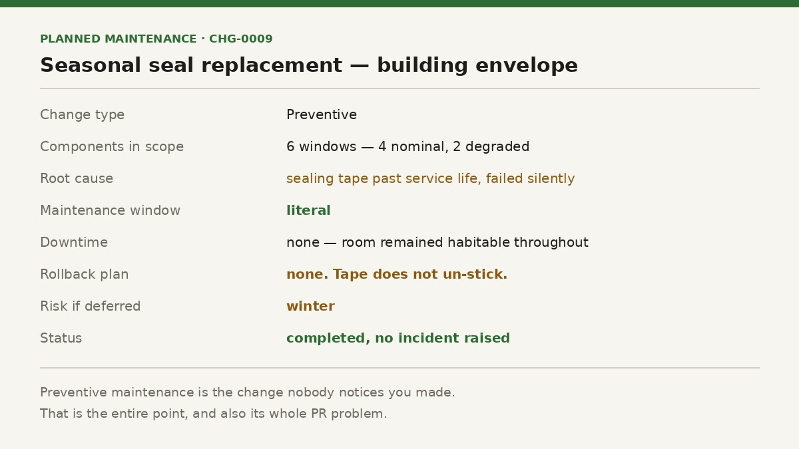
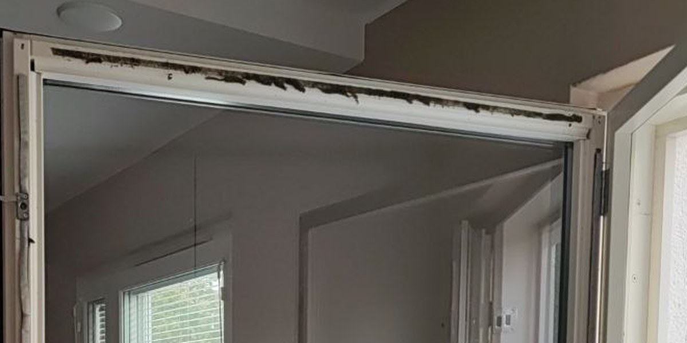
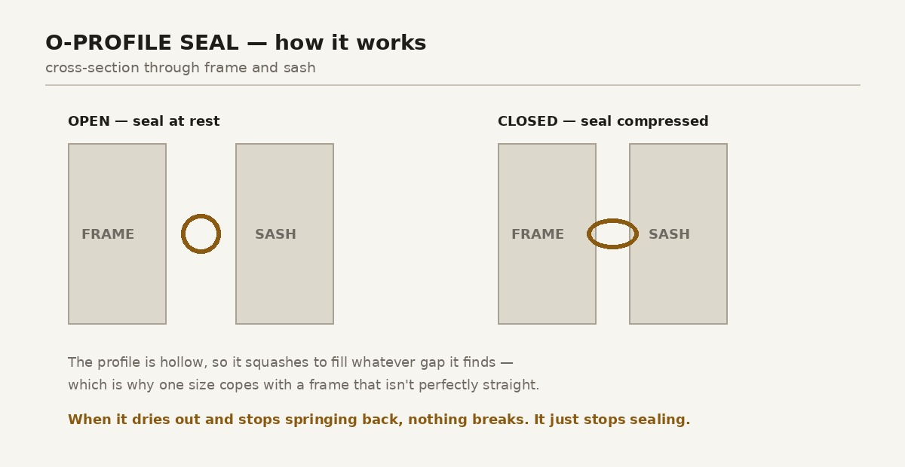
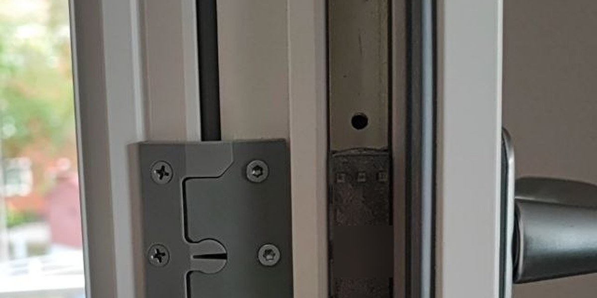

This week I did Windows maintenance.

Not that Windows. The ones in the walls.

The lab has been quiet — Phase 2 is waiting its turn, and the rack continues to hum in the corner without me. Meanwhile, September arrived in Stockholm and reminded me that there is a deadline coming that does not negotiate, accept excuses, or slip to next sprint.

## What a Swedish window actually is

For readers in gentler climates: windows here are typically two windows. An outer half facing the weather, an inner half facing the room, and a gap of air between them doing the actual insulating.

The inner half opens independently, which means the space between the panes can be cleaned, and — the part that matters — the sealing tape around the inner frame can be inspected and replaced. The whole assembly is designed to be serviced by the person who lives there.

Which is a nicer piece of design thinking than it first appears. Somebody decided that a component with a predictable service life should be reachable without specialist tools. I have worked with rather a lot of equipment that did not extend me the same courtesy.

## The assessment

Six windows. Four of them date from the flat's refurbishment in 2020 and needed nothing but separating and cleaning. Fine. Nominal. Move on.

Two of them are older, and their sealing tape had reached the end of its life in the least dignified way available: dried out, gone brittle, and disintegrating into crumbs when touched. The compressible foam that should be filling the gap between frame and sash was now a substance with the structural properties of stale biscuit.

Nothing had failed. Nothing announced itself. The window still closed, still latched, still looked like a window. It had simply stopped doing one of the things it was there for, silently, over several years.

I find that failure mode extremely familiar.

## The procedure

Remove the old tape, which comes away in pieces and never all at once. Spray the adhesive residue with solvent, leave it to work, then scrub with a plastic scrubber — plastic, because the frame is softer than my enthusiasm and I would like to keep it unscratched.

Then clean the surface again with denatured alcohol, because the solvent leaves an oily film behind, and new adhesive tape applied to an oily surface is a job you get to do twice. Let it dry properly.

Then the new seal: 7 mm O-profile tape, applied to a clean, dry, cool surface, in one continuous run per side rather than a mosaic of offcuts.

The profile is hollow, which is the whole trick. It compresses to fill whatever gap it finds, so a single size copes with a frame that isn't perfectly straight — and no frame this old is perfectly straight. What fails, years later, is the springing back. The material hardens, stops recovering its shape, and quietly stops touching both surfaces at once.

There is no rollback plan for this change. Tape does not un-stick. You measure, you commit, and you get it right the first time — which concentrates the mind in a way that a version-controlled configuration file simply does not.

## The part that's actually about infrastructure

Preventive maintenance is the least glamorous category of work there is, and it has an image problem: when it goes well, absolutely nothing happens. No incident, no ticket, no story. Just a room that stays warm and a heating bill that doesn't quietly climb.

The two failed seals were the interesting case, because they demonstrate the specific way this kind of thing goes wrong. Slow degradation of a component nobody inspects, in a system that appears to be working, with a failure that only announces itself under load — in this case, the first properly cold night, at which point you are fixing it in February with the wind coming through.

The four newer windows are the counter-example. Maintained on schedule, they cost me an afternoon of cleaning. The neglected pair cost solvent, scrubbing, waiting, materials and roughly four times the effort.

That ratio is not specific to windows. Deferred maintenance is a loan with a variable interest rate, and the rate goes up precisely when you can least afford to pay it.

Winter here is not an abstract risk on a register. It arrives on a schedule, indifferent to whether you got round to it.

The tape is on. The rack, unhelpfully, remains at room temperature.

---

*I'm Ioannis — an IT operations, systems, and networking engineer based near Stockholm. The Itchef Hybrid Project (IHPC) is a real hybrid infrastructure lab, built and documented in public. Repo: [github.com/TheITchef/IHPC](https://github.com/TheITchef/IHPC) · [LinkedIn](https://www.linkedin.com/in/ioannis-mintzivyris-a1b77873/)*
